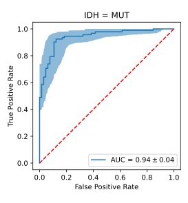
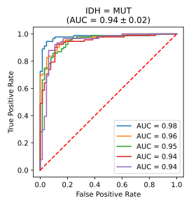
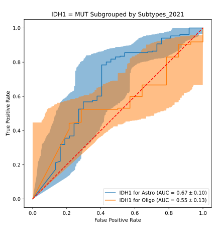
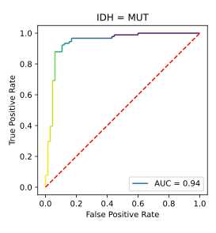

# Visualizations Cookbook

## Receiver Operating Characteristic Curves

### A Single ROC Curve with Bootstrapped 95% Confidence Intervals



```sh
python -m wanshi.visualizations.roc \
    --outpath=/project/path/single_roc.svg \
    --target-label=IDH \
    --true-label=MUT \
    --n-bootstrap-samples=1000 \
    /path/to/patient-preds.csv
```

### ROC Curves for a Cross-Validation Experiment



```sh
python -m wanshi.visualizations.roc \
    --outpath=/project/path/crossval_rocs.svg \
    --target-label=IDH \
    --true-label=MUT \
    /path/to/fold-*/patient-preds.csv
```

### ROC Curves for Different Subgroups



```sh
python -m wanshi.visualizations.roc \
    --outpath=/project/path/roc_subgroups.svg \
    --target-label=IDH1 \
    --true-label=MUT \
    --n-bootstrap-samples=1000 \
    --clini-table=/path/to/clini.xlsx \
    --subgroup-label=Subtypes_2021 \
    --figure-width=6 \
    /path/to/patient-preds.csv
```

`--figure-width=6` is used to increase the figure width to 10 inches,
in order to make space for the longer text in this type of plot.

### A Single ROC Curve Colored by Threshold



```sh
python -m wanshi.visualizations.roc \
    --outpath=/project/path/threshold_roc.svg \
    --target-label=IDH \
    --true-label=MUT \
    --threshold-cmap=viridis \
    /path/to/patient-preds.csv
```
