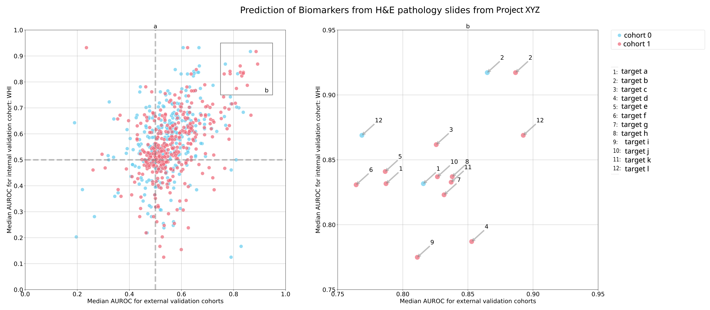

# Visualizations Cookbook

## Scatterplot for multi-cohort multi-target visualization



```sh
python -m wanshi.visualizations.multi_cohort_scatter.multi_cohort_scatter \
    --data-path-internal="/home/marcogustav/Documents/projects/xyz/results/crossval" \
    --data-paths-external="/home/marcogustav/Documents/projects/xyz/results/deploy/ext_cohort_1" \
    --data-paths-external="/home/marcogustav/Documents/projects/xyz/results/deploy/ext_cohort_2" \
    --title="Prediction of Biomarkers from H&E pathology slides from XYZ" \
    --internal-cohort-name="int_cohort" \
    --format="norm" \
    --outpath="/home/marcogustav/Documents/projects/gecco/results/crossval/figures/" 
```

`data-path-internal` includes subdirectories with the name of `--format` - e.g. `raw` and `norm`. These subdirectories
contain directories for each target. Each of the target directories contains a directory for each fold with the
prediction.csv.
The same applies to each `data-paths-external` directory.
